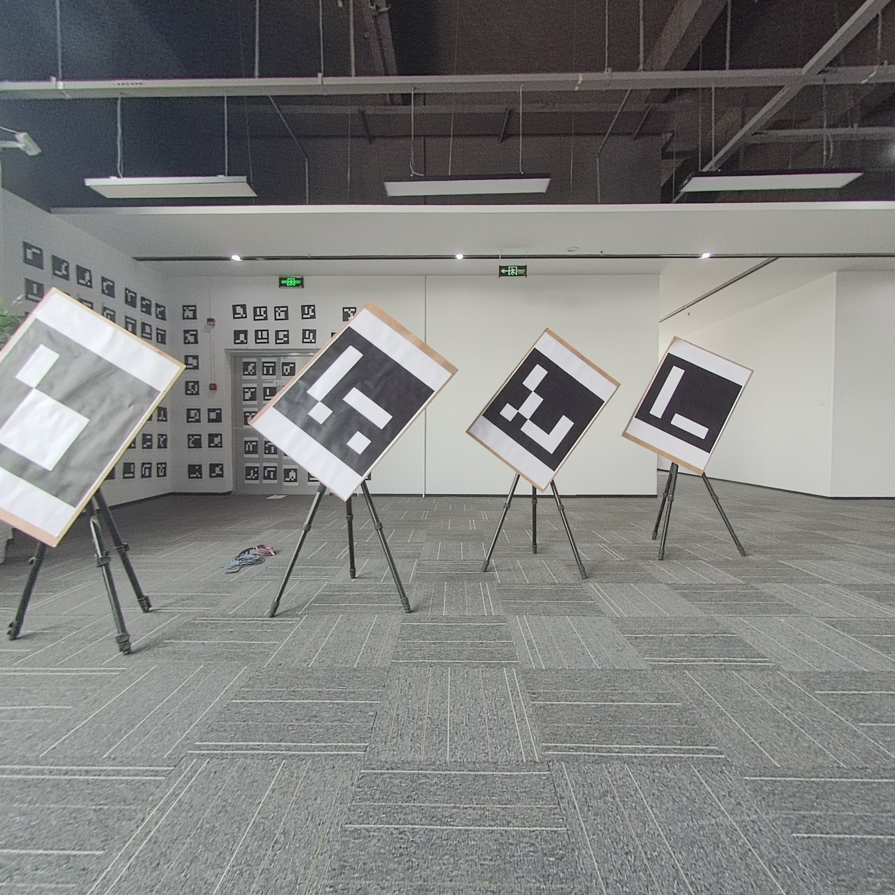
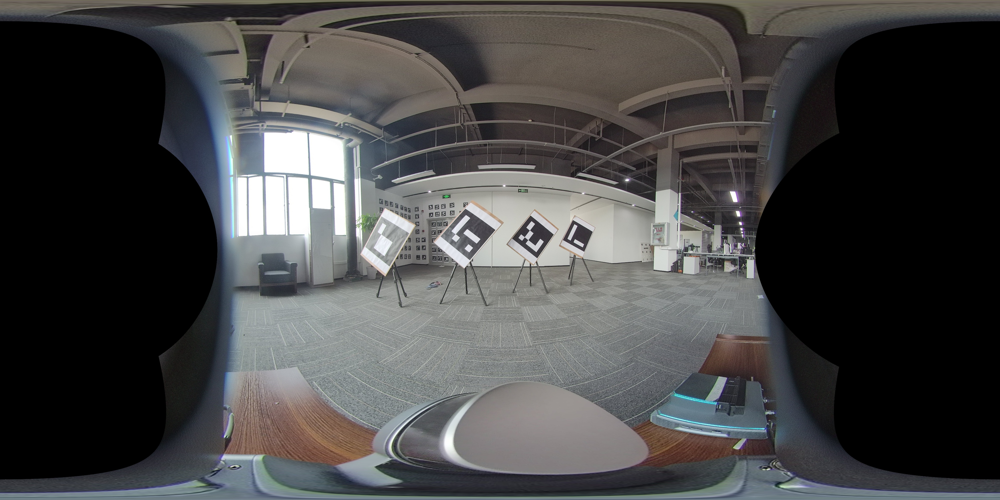
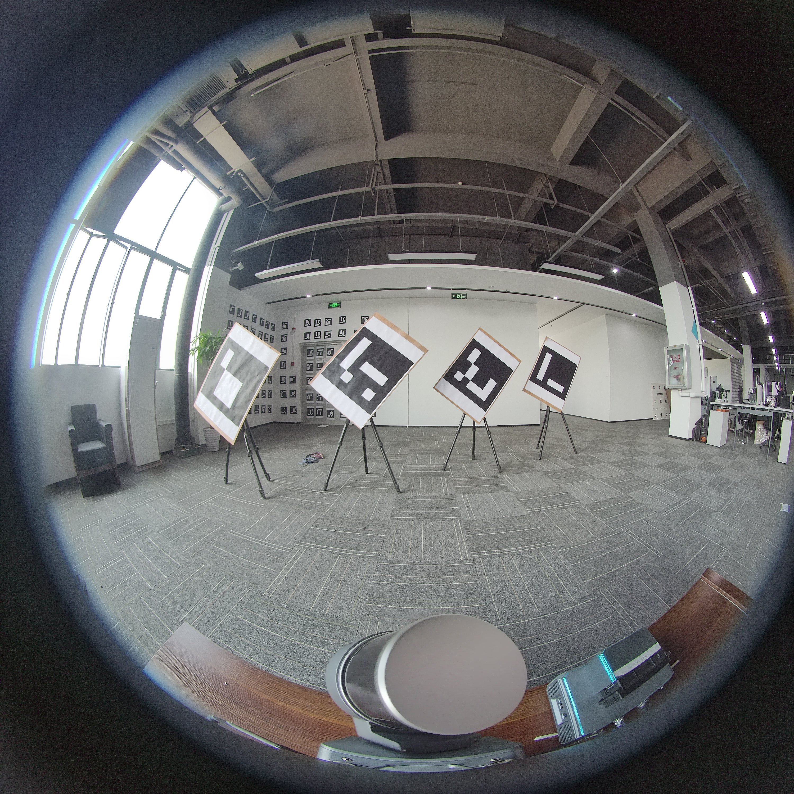

# **general_camera_model**

This resposity is a C++ library for an extensible generic camera model.[version 0.1.1]

## **Camera Model Lists**
|相机模型| 描述| 图片示例|
|:-:|:-:|:-:|
| SimplePinholeCameraModel| 简单小孔模型,由焦距f,图像中心(cx, cy)定义|
|EquirectangularCameraModel | 等距圆柱投影模型||
|OpenCVPinholeCameraModel| OpenCV小孔模(fisheye相机模型一部分),由焦距(fx, fy),图像中心(cx, cy),径向畸变参数(k1, k2, p1, p2)定义| |
|OpenCVFisheyeCameraModel| OpenCV鱼眼相机模型,由焦距(fx, fy),图像中心(cx, cy),4个径向畸变参数(k1, k2, k3, k4)定义| | 
|OmniDirectionalCameraModel| 鱼眼相机模型,由像素尺寸xi,焦距(fx, fy),图像中心(cx, cy),3个径向畸变系数(k1, k2, p1, p2)定义| |
|CubeMapCameraModel| 立方体贴图模型||
|DoubleSphereCameraModel| 双球相机模型| |
|ExtendedUnifiedCameraModel| EUCM相机模型| |
|UnifiedCameraModel| UCM相机模型| |
|FovCameraModel| Fov相机模型| |

-------------
## **TODO**

- [ ] add camera model jacob computation

------------
## **How to run the code**


```shell
sh build_release.sh
```